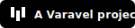
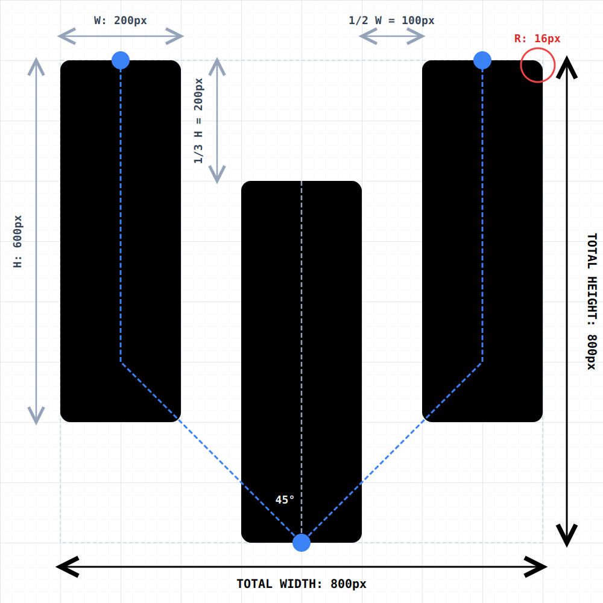

# Varavel Brand & Design Guidelines

Welcome to the official brand repository for **Varavel**.

This repository contains our visual identity assets, logo specifications, and design principles.

Varavel's design language is focused on clarity, structure, and technical precision, reflecting the systems we build.

## The Logo

The Varavel logo is composed of three pillars, representing the foundational stages of data processing and system architecture:

- **Left Pillar (Input):** Represents the point of user interfaces, client requests and data ingestion.
- **Central Pillar (Processing):** Represents the core engine. It is deliberately shifted downward to symbolize the foundational computing layer where data transformation, routing, and logic occur.
- **Right Pillar (Output):** Represents the final delivery, response, and scale back to the client or external systems.

The displacement of the central pillar naturally creates a negative-space **"V"**, structurally tying the geometric shape to the Varavel name.

### Geometry & Proportions

The logo is constructed on a strict mathematical grid to maintain visual stability and crisp rendering across all sizes.

- **Proportions:** Each pillar maintains a 1:3 aspect ratio (`200px` width by `600px` height).
- **Spacing:** The horizontal gap between pillars is exactly half the width of a single pillar (`100px`).
- **Displacement:** The central pillar is offset downwards by exactly one-third of its height, creating a consistent 45 degree angle for the inner "V".
- **Micro-Bevel:** A 2.6% border radius (`16px` on a `600px` pillar) is applied to all corners. This subtle rounding softens the edges for digital screens and anti aliasing, while maintaining a solid architectural silhouette.
- **Footprint:** These measurements organically form a perfect 1:1 (`800px`) square bounding box, ensuring precise alignment in UI layouts and avatars.

### The "VA" Interaction

In specific interactive contexts (such as UI navbars), hovering over the logo transitions the central pillar upward and the others downward. This movement inverts the negative space to form an **"A"**, revealing the first two letters of the brand (**VA**ravel).

## Color Strategy

Varavel uses a strict monochromatic base. The core brand assets (logo and typography) are rendered exclusively in **Solid Black (`#000000`)** or **Solid White (`#FFFFFF`)**.

By keeping the core identity neutral, we allow semantic colors (success greens, error reds) and specific UI accents to guide the user's attention within our tools and dashboards without visual conflict.

## Typography

Varavel uses the **Geist** typeface family by **Vercel**, licensed under the **Open Font License (OFL 1.1)**, as the official brand font in the following formats:

- **Sans Serif:** Geist
- **Mono:** Geist Mono

Source: https://github.com/vercel/geist-font

## Repository Structure

- `/src`: Original vector files (`.inkscape.svg`).
- `/dist`: Production ready SVGs and PNGs, optimized for direct use including padded, high resolution PNGs (1280x1280 with a 640px safe zone) designed specifically for circular platform avatars.
